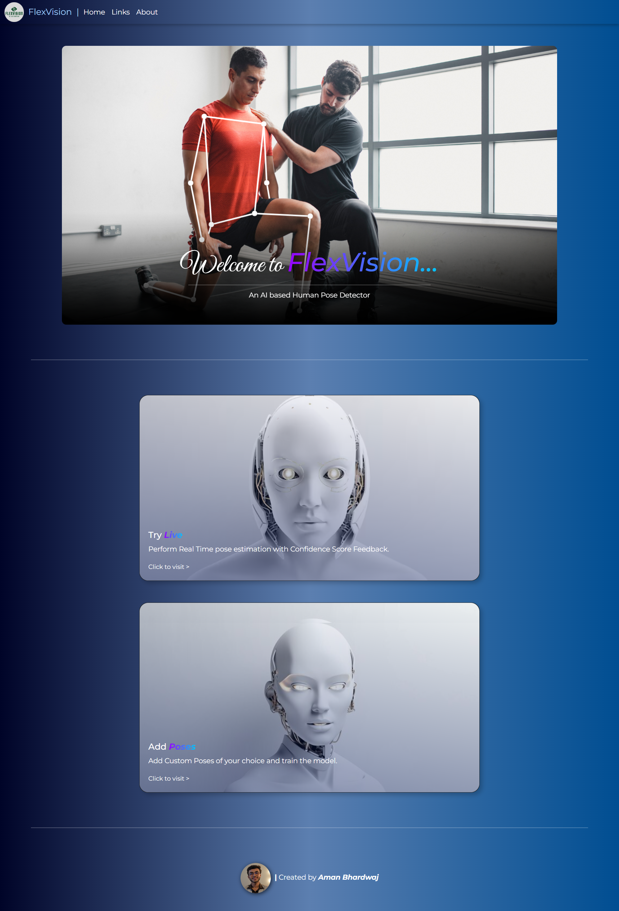
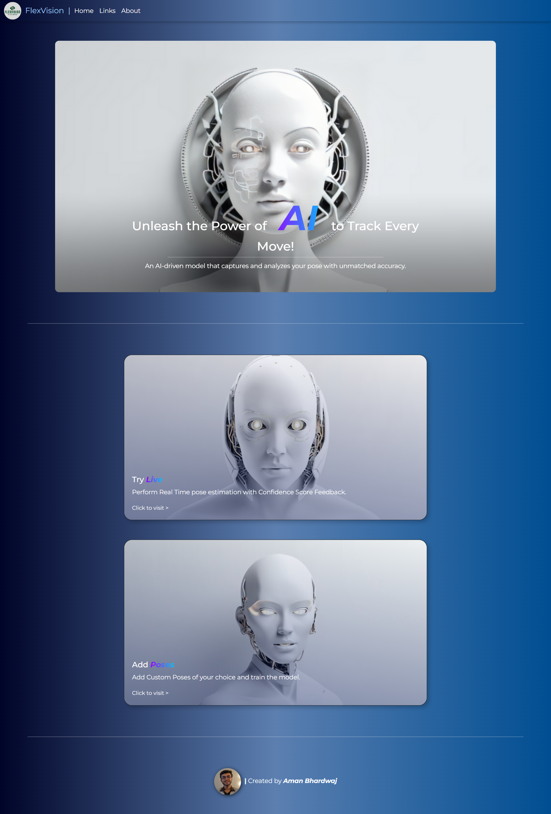
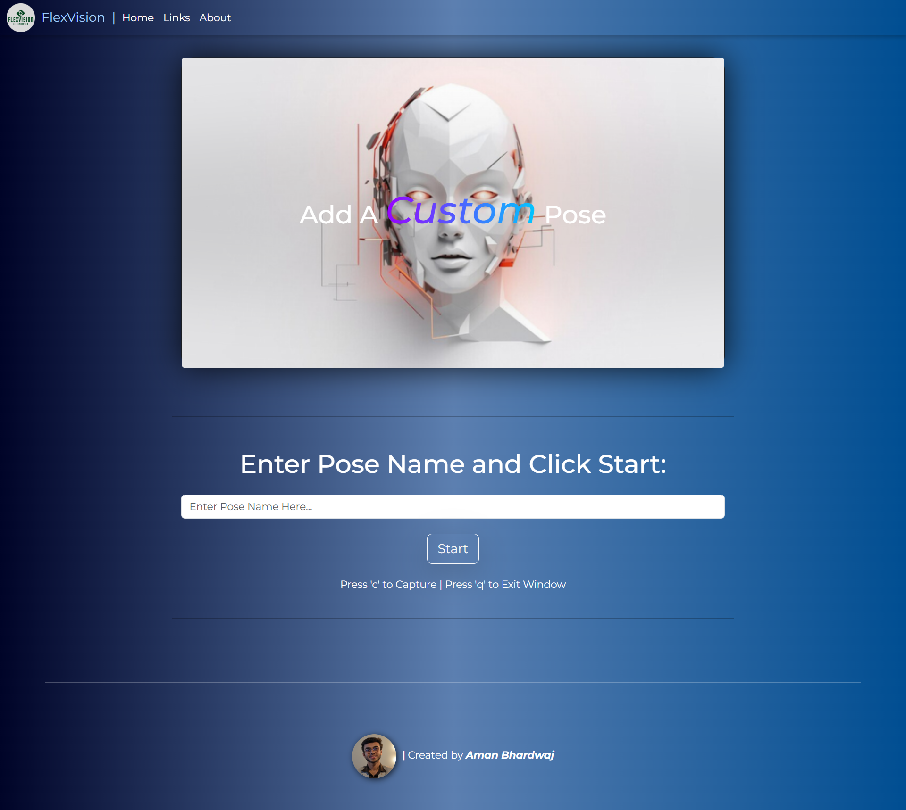
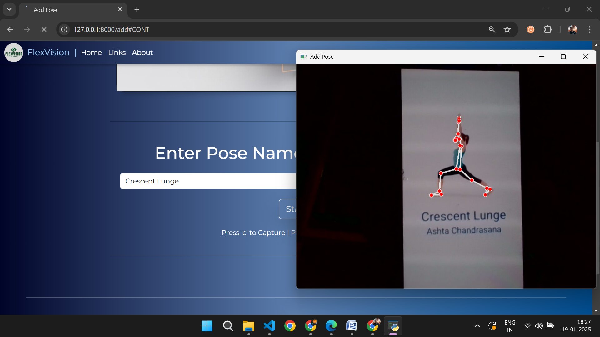
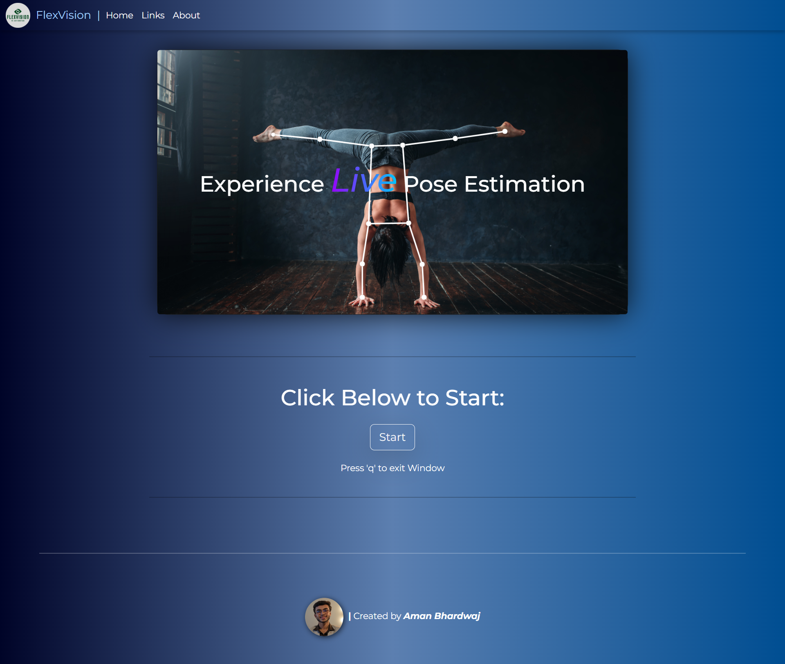
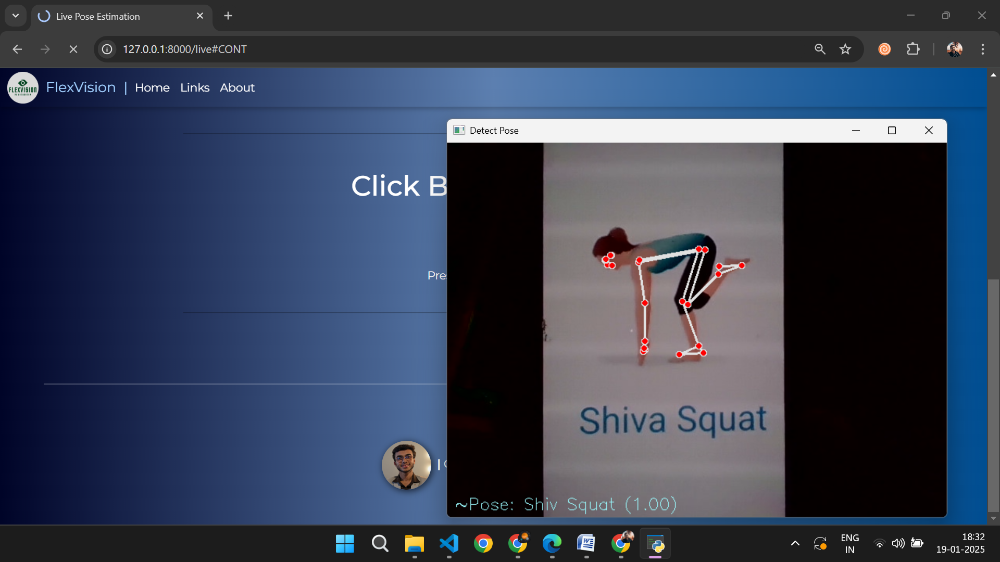

# FlexVision 🌟  
**Real-Time Human Pose Estimatior and Custom Pose Classifier**

FlexVision is an interactive web-based application that combines computer vision and machine learning to estimate and classify human poses in real-time. Built using **Mediapipe**, **Flask**, and **OpenCV**, it empowers users to monitor movements, ensure correct posture, and even create custom pose models for specific applications.

---

## Features 🚀  

- **Real-Time Pose Estimation**:  
  Detect and analyze human poses using Mediapipe's efficient pose detection module.  

- **Custom Pose Classification**:  
  Add and train custom poses with an intuitive interface, enabling the model to recognize user-specific movements.  

- **Live Feedback**:  
  Get confidence scores and visual feedback for every detected pose on the video feed.  

- **Lightweight and Accessible**:  
  Runs efficiently on low-resource devices without requiring GPUs.  

---

## How It Works 🛠️  

### 1️⃣ Capture Live Feed  
FlexVision uses your webcam to capture real-time video and extract skeletal landmarks.  

### 2️⃣ Detect and Classify Poses  
Using a **K-Nearest Neighbors (KNN)** model, FlexVision matches live inputs with stored poses and provides classification results.  

### 3️⃣ Add Custom Poses  
Easily store your own poses via the **Add Pose** feature, creating a personalized library of movements.  

---

## Requirements

To run this project, you need to install the required dependencies. You can install them using `pip` by running the following command:

```
pip install -r requirements.txt
```

---

# Note:
### Add poses of your choice to create a pickle file before starting 'Detection'
### To check stored poses refer to check_pose.py

---

## Screenshots 📸
<br>












